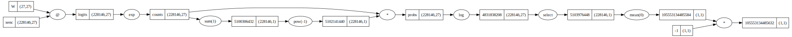

# lofi-ai

### 📚 Overview

lofi-ai is a C++ header-only machine learning framework created for educational
purposes. Inspired by Andrej Karpathy's
[micrograd](https://github.com/karpathy/micrograd), it builds upon my earlier
project, [micrograd_cpp](https://github.com/riskybacon/micrograd_cpp).

lofi-ai's only requirement is a compiler with C++20 support. No separate
libraries are needed.

The project provides a simplified implementation of common ML components,
including automatic differentiation.

I'm developing this library as a hands-on way to deepen my understanding of
machine learning frameworks. I'm specifically interested in CUDA support.

### 🚀 Features

*Basic Operations*: Matrix operations like addition, multiplication, transpose,
and elementwise transformations.

*Broadcasting*: Row and column vectors can be broadcast match the dimensions of
other matrices.

*Autograd*: Backward pass differentiation is performed automatically, with the
computational graph being traversed in a single call.

*Visualization*: Computational graph can be visualized using graphviz

*Simple*: No external libraries, code is easy to read.

### 🛠️ Build and run

1. Clone the repository:
```bash
git clone https://github.com/riskybacon/lofi-ai.git
cd lofi-ai
```

2. Build and run example:
```bash
cd examples
make
./one_layer
```

3. Build and run tests:
```bash
cd test
make
./test_storage
./test_context
./test_engine
```

### 🧪 Example:

Example training loop for a simple network:

```cpp
auto W = Matrix<float>::randn({vocab_size, vocab_size}, g);
auto xenc = Matrix<float>::one_hot(xs, vocab_size);

for (size_t k = 0; k < num_steps; k++) {
    // Forward
    auto logits = matmul(xenc, W);
    auto counts = logits.exp();
    auto probs = counts * counts.sum(1).pow(-1.0f);

    // Loss
    auto logprobs = probs.log();
    auto loss = -logprobs[selector].mean(0);

    // Backward
    loss.zero_grad();
    loss.backward();

    // Weight update
    W.data() += -lr * W.grad();
}
```



### 📝 TODO

- [ ] Add features
  - [ ] max()
  - [ ] Transformer blocks
  - [ ] Forward pass graph capture / delayed execution
- [ ] Increase test coverage
  - [ ] Carefully verify correctness
- [ ] Break out MatrixStorage into two classes
- [ ] Add Perfetto support
- [ ] Optimize for CPU
  - [ ] Faster matmul
  - [ ] Fuse kernels in backward pass
- [ ] Add CUDA support
  - [ ] CUDA-based matmul replacement
  - [ ] cuDNN

### 🤝 Contributing

Contributions are welcome! If you have ideas for improving this project or find
any bugs, feel free to open an issue or submit a pull request.

### 🪪 License

This project is licensed under the MIT License. See the LICENSE file for more
information.

### References

* [micrograd](https://github.com/karpathy/micrograd)
* [micrograd video](https://www.youtube.com/watch?v=VMj-3S1tku0)
* [Building makemore Part 4: Becoming a Backprop Ninja](https://www.youtube.com/watch?v=q8SA3rM6ckI)
* [micrograd_cpp](https://github.com/riskybacon/micrograd_cpp)